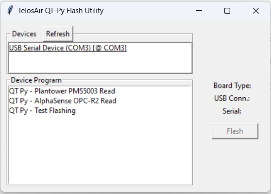

# QTPyFlashUtility - v1.0.0

This repo contains code for flashing the QT Py SAMD21 Board with a precompiled code. 

This will serve for now as a means for SMC/SNU to flash the QT Py with code to read the PMS5003 or OPC-R2. Eventually, this will be used as a basis for a more mature program for them to use with the Mannequin project.





## To Build

### Environment Prep

#### All OSes

* Install all of the dependencies using `pip3`.
    * For Windows, install all the dependencies in `requirements_windows.txt`.
    * For Mac OS, install all the dependencies in `requirements_mac.txt`.

```bash
pip3 install requirements_windows.txt
```
* Either add the folder where `pyinstaller`'s binary is located to your `PATH`, or copy it for use in the terminal later. Depending on your
installation, this location may already be on your `PATH`. You can check by just trying to call it by name:

```bash
pyinstaller
```

#### Windows
* Install `InstallForge`. This is an app for creating installable packages easily.
```
https://installforge.net/downloads/?i=IFSetup 
```

#### Mac OS
_Nothing yet as it is not needed._


### Compile Program with Pyinstaller

First you will need to "compile" the code with Pyinstaller. From a PowerShell/Terminal in the project directory, do the following command:

``` powershell
pyinstaller .\app.spec
```

This should create two folders, `build` and `dist` in the current directory. 

`dist/App/TelosAirQTPyFlashUtil.exe` is the executable that will run the program. You may want to now run that to see if it works as expected
after pyinstaller has done its thing. A lot of resources need to be compiled and linked so this is where you would find out if there was an issue.

If you are satisfied, move onto the next step for Windows.

_Note: I have not tested Pyinstaller with Mac OS yet since it is not needed for deliverables._

### Package Compiled Program for Installation on a Clean OS

#### InstallForge (Windows)

* Open InstallForge after you've installed it.
* Open the file `install_forge_project.ifp` by clicking the `open` button on the top.
* Click `General` and verify that the version number is good.
* Click `Build` on the __left side of the screen__ to open the build menu. Then make sure that the `Setup File` has a full path in it.
If it doesn't, press the `...` button to select somewhere tangible to put it. Otherwise it will just build it and put it somewhere wacky.
* Click `Remove All` at the top of the screen to remove the files from whoever last used this and commited it.
* Click `Add Folder` and add the `dist/App` folder created by Pyinstaller. This folder contains everything needed to run the app.
* Click `Build` on the __top of the screen__ to actually run the build.
    * _Note: If you have any issues during building, sometimes closing InstallForge and reopening it will magically fix it. Just make sure you save or reapply your changes before rebuilding._
* [Optional] Uninstall TelosAirQTPyFlashUitl from your computer first to make sure you get a clean install.
* Run the `.exe` output by InstallForge, usually `TelosAirQTPyFlashUtilInstaller.exe` and follow the installer.
* Open `TelosAirQTPyFlashUtil` and verify it still works as expected.

If you run into any bugs that need to be fixed in the code, you will have to fix them and then start over at the Pyinstaller section.

## To Install
Either follow the `To Build` section and create an installer for your OS/architecture, or click on `Releases` to the right, sometimes at the top, of this page. Then find the newest version for your OS/architecture and click on it. Then you can click on the `.exe` file and it will download it to your computer. That link is also good for sharing with a client.

## To Run

### As a Python Module

Open a terminal/PowerShell in the main folder and run it with `python3`:

```bash
python3 -m TelosAirSAMDBoardFlashGUI
```

### As a Compiled Python Program

Build with `Pyinstaller` (see `To Build`) and navigate to `./dist/App/`. The compiled `.exe` or `.bin` should be in that folder as `TelosAirQTPyFlashUtil.exe` or whatever the extension for your OS. Double click it or call it from a terminal to run.

### As a Windows Application

After installing with the installer downloaded in the `Releases` section, or created by `InstallForge` in the `To Build` section, you can click the Windows button or press it on the keyboard and type in `TelosAirQTPyFlashUtil` and run it. You may also right-click it when you find it to pin it to the taskbar.