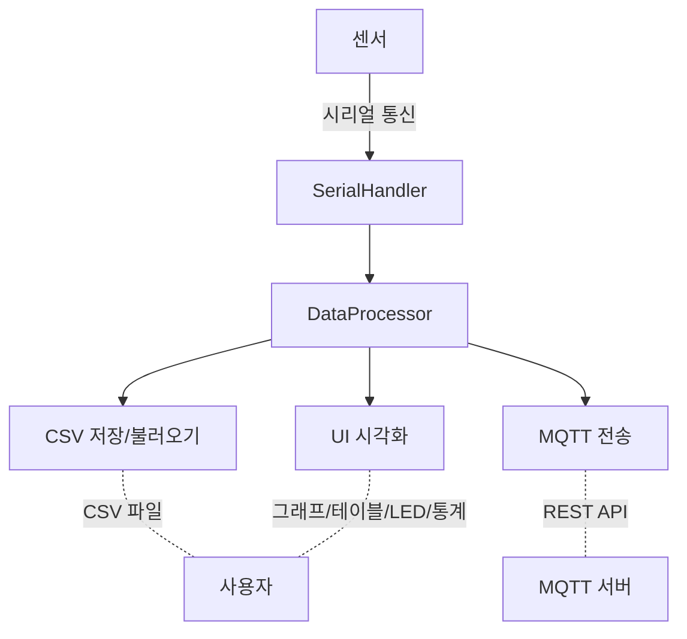

# 🎛️ DUET 모니터링 시스템

> **실시간 센서 데이터 수집 · 시각화 · 저장 · 분석 · MQTT 연동까지 올인원 데스크탑 애플리케이션**

---


---

## 📝 프로젝트 소개

**DUET 모니터링 시스템**은 시리얼 기반 센서 데이터를 실시간 수집/시각화/저장/분석/통계/REST MQTT 연동까지 지원하는 통합 데스크탑 애플리케이션입니다.

- **센서 데이터 실시간 수집 및 시각화**
- **CSV 저장/불러오기 및 통계 분석**
- **MQTT 서버 연동(REST API)**
- **다양한 모드(전체/경량/테스트) 및 직관적 UI**
- **토큰 기반 인증 및 자동 재발급/재로그인**
- **Docker 및 라즈베리파이 에뮬레이션 지원**

---

## 🚀 주요 기능

- **실시간 센서 데이터 수집/시각화/통계**
- **CSV 저장/불러오기**
- **모드 전환**: 전체/경량/테스트/401테스트
- **MQTT 연동**: REST API로 데이터 전송, 인증/토큰/재발급/재로그인 자동 처리
- **로그인/회원가입/토큰 관리**
- **Docker/QEMU 기반 라즈베리파이 에뮬레이션**
- **상세 로그 및 디버깅 지원**

---

## 📂 폴더 구조

```text
duet_monitor/
  ├── core/         # 데이터 처리, 시리얼 통신, CSV 핸들러 등
  ├── ui/           # 메인 윈도우, 그래프, 테이블, LED, 제어 패널 등
  ├── config/       # API, 센서, 포트, 단위 설정
  ├── utils/        # 보조 함수 및 유틸리티
  ├── mqtt/         # MQTT 연동 모듈
  ├── main.py       # 메인 실행 파일
logs/               # 디버그 및 실행 로그
run_duet_monitor.sh # 바로 실행용 셸 스크립트
Dockerfile          # 도커 환경 설정
start.sh            # QEMU 라즈베리파이 에뮬레이터 실행
requirements.txt    # 의존성 목록
index.html          # 유즈케이스 다이어그램
```

---

## ⚡ 설치 및 실행

### 1. Python 환경

- **Python 3.11 이상** 필요
- 의존성 설치:
  ```bash
  pip install -r requirements.txt
  ```

### 2. 바로 실행 (권장)

```bash
sh run_duet_monitor.sh [옵션]
```

- venv 자동 생성/활성화, 로그(`logs/last_run.log`) 저장
- 예시:
  ```bash
  sh run_duet_monitor.sh --test401 --debug
  ```

### 3. 직접 실행

```bash
python duet_monitor/main.py [옵션]
```

### 4. 주요 옵션

| 옵션            | 설명                                                                                   |
| --------------- | -------------------------------------------------------------------------------------- |
| `--test`        | 테스트 모드(가상 데이터)                                                               |
| `--lightweight` | 경량 모드(간소화된 UI)                                                                 |
| `--full`        | 전체 모드(모든 기능)                                                                   |
| `--skipui`      | 모드 선택 UI 건너뛰기                                                                  |
| `--debug`       | 디버그 모드(상세 로그)                                                                 |
| `--test401`     | 401 인증 에러 시나리오 강제 테스트(실제 서버 요청 없이 토큰 재발급/재로그인 흐름 검증) |

---

## 🔑 인증/토큰/401/재발급 시나리오

- **MQTT 전송 시 401 에러** 발생 시, 자동으로 토큰 재발급 시도 → 실패 시 로그인 다이얼로그 표시
- **test401 옵션**: 실제 서버 요청 없이 401 시나리오 강제 테스트(토큰 재발급/재로그인 흐름 실제와 동일)
- **토큰 재발급 성공 시** test401 모드 해제, 일반 모드로 전환
- **상세 로그**: `logs/last_run.log` 및 `logs/` 내 디버그 파일에서 토큰, 요청/응답, 예외, 재발급 성공/실패, 재로그인 등 전체 흐름 확인 가능

---

## 🔄 데이터 흐름



---

## 🌐 MQTT/REST 연동

- 센서 데이터는 `https://smartair.site/mqtt/receive`로 전송
- **Swagger 문서**: [https://smartair.site/swagger-ui/index.html#/](https://smartair.site/swagger-ui/index.html#/)
- 토큰 만료/401 발생 시 자동 재발급 및 재로그인
- 엔드포인트/요청 구조는 Swagger 문서 기준

---

## 🐳 Docker/QEMU 라즈베리파이 에뮬레이션

- `Dockerfile` 및 `start.sh` 참고
- QEMU로 라즈베리파이3B+ 환경 에뮬레이션, USB 센서 테스트 가능
- 실제 센서 연결 없이 개발/테스트 가능

---

## 🗂️ 유즈케이스 다이어그램

- `index.html`에서 웹 기반 유즈케이스 다이어그램 확인 가능

---

## 🛠️ 주요 의존성

- pyserial, pandas, matplotlib, requests, paho-mqtt 등

---

## 💡 참고

- 모든 실행/디버그 로그는 `logs/` 폴더에 저장
- `run_duet_monitor.sh`로 venv 자동 관리 및 실행
- 인증/토큰/401/재발급/재로그인 전체 흐름은 Swagger 문서 기준으로 동작

---

> 본 프로젝트는 오픈소스이며, 자유롭게 수정 및 배포하실 수 있습니다.
