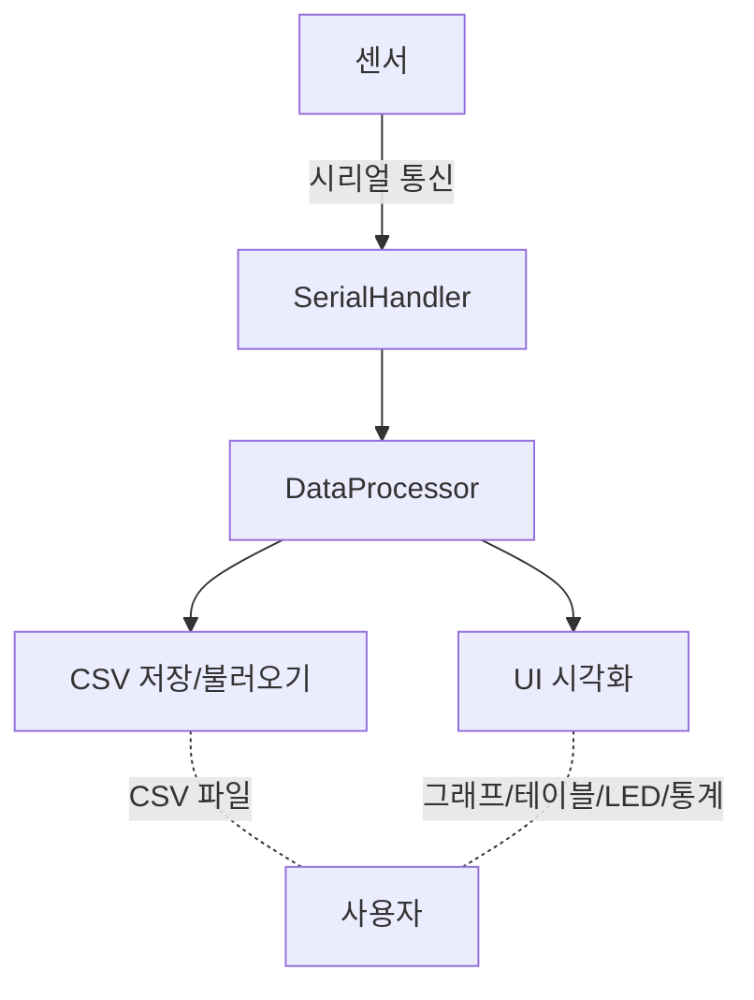

# 🎛️ DUET 모니터링 시스템

> **실시간 센서 데이터 수집 · 시각화 · 저장 · 분석 올인원 데스크탑 애플리케이션**

---


---

## 📝 프로젝트 소개

**DUET 모니터링 시스템**은 시리얼 통신 기반의 다양한 센서 데이터를 실시간으로 수집하고, 직관적인 UI로 시각화하며, CSV로 저장/불러오기 및 통계 분석까지 지원하는 통합 모니터링 데스크탑 애플리케이션입니다.

---

## 🚀 주요 기능

- **실시간 센서 데이터 수집** : 시리얼 포트(USB 등)로 연결된 센서 데이터 실시간 수집
- **데이터 시각화** : 센서별 실시간 그래프, LED 디스플레이, 통계 요약, 데이터 테이블 제공
- **데이터 저장/불러오기** : CSV 파일로 데이터 저장 및 불러오기 지원
- **모드 전환** : 전체 모드/경량 모드/테스트 모드 지원 (명령행 인수 또는 UI에서 선택)
- **다중 센서 지원** : 여러 센서 데이터 동시 시각화 및 선택적 표시
- **직관적 UI** : 포트 선택, 센서 제어, 데이터 제어, 그래프/테이블/통계 등 다양한 UI 컴포넌트 제공

---

## 📂 폴더 구조

```text
duet_monitor/
  ├── core/         # 데이터 처리, 시리얼 통신, CSV 핸들러 등 핵심 로직
  ├── ui/           # 메인 윈도우, 그래프, 테이블, 제어 패널 등 UI 구성
  ├── config/       # 설정 파일
  ├── utils/        # 보조 함수 및 유틸리티
  ├── __main__.py   # 패키지 실행 진입점
  ├── main.py       # 메인 실행 파일
  └── ...
```

---

## ⚡ 설치 방법

1. **Python 3.8 이상**이 필요합니다.
2. 의존성 설치:
   ```bash
   pip install -r requirements.txt
   ```
   또는 패키지 설치:
   ```bash
   pip install .
   ```

---

## ▶️ 실행 방법

### 1. 기본 실행

```bash
python -m duet_monitor.main
```

### 2. 명령행 옵션

| 옵션            | 설명                     |
| --------------- | ------------------------ |
| `--test`        | 테스트 모드(가상 데이터) |
| `--lightweight` | 경량 모드(간소화된 UI)   |
| `--full`        | 전체 모드(모든 기능)     |
| `--skipui`      | 모드 선택 UI 건너뛰기    |
| `--debug`       | 디버그 모드              |

예시:

```bash
python -m duet_monitor.main --full --debug
```

### 3. 패키지 설치 후 콘솔 명령어

```bash
duet-monitor
```

---

## 🛠️ 주요 의존성

- pyserial==3.5
- pandas==2.2.1
- matplotlib==3.8.3
- numpy>=1.24.0

---

## 🔄 데이터 흐름



---

## 💡 참고 및 기타

- `logs/` 폴더에 디버그 로그가 저장됩니다.
- `index.html`은 별도의 웹 기반 유즈케이스 다이어그램 예시입니다(프로그램 실행과 직접적 연동 없음).

---

## 📧 문의

- 개발/사용 문의: <이메일 또는 연락처 기입>

---

> 본 프로젝트는 오픈소스이며, 자유롭게 수정 및 배포하실 수 있습니다.
